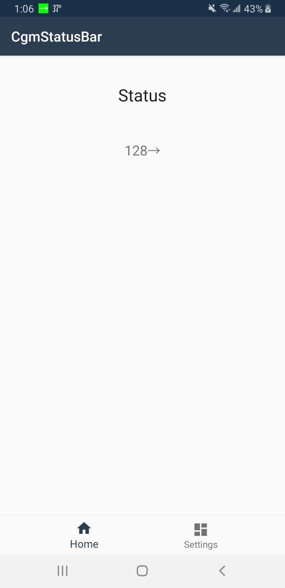
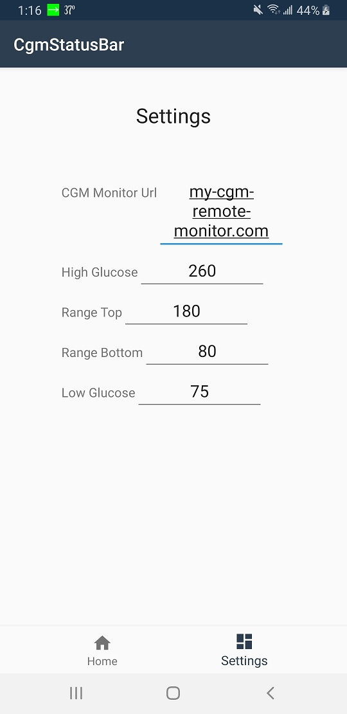
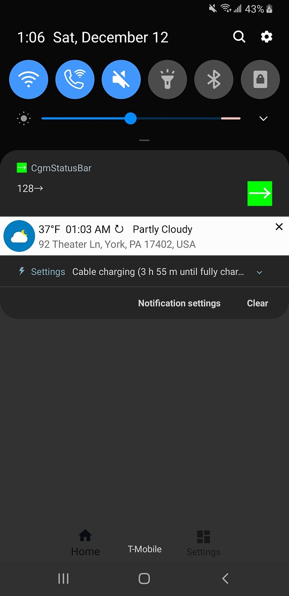

# cgm-status-android

**cgm-status-android** is an Android app that pulls CGM data from [nightscout/cgm-remote-monitor](https://github.com/nightscout/cgm-remote-monitor) and displays the most recent Blood Glucose value in a notification along with the trend arrow and color in the status bar icon. The Dexcom Follow app does not provide a way to monitor via notifications, you must open their app manually to see the current value. This will allow you to monitor without unlocking your phone.

- Add the Url to your deployment of [nightscout/cgm-remote-monitor](https://github.com/nightscout/cgm-remote-monitor)
- The color of the icon is based on the settings you provide for High and Low BG, and your target BG range.
    - Green: BG is within the target range
    - Orange: BG is above or below the target range, but not yet at the high or low values
    - Red: BG is above the high value or below the low value

---

